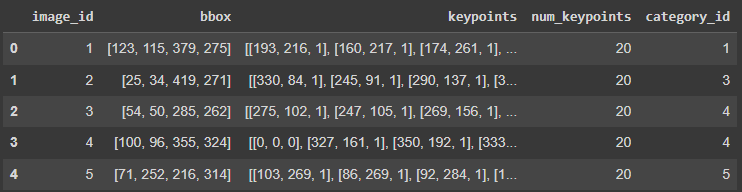
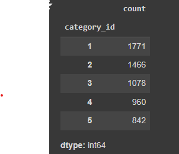
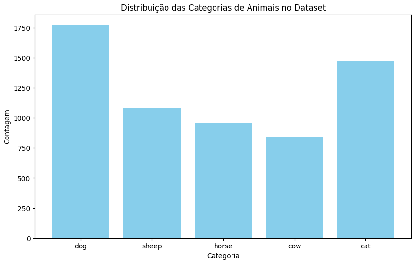
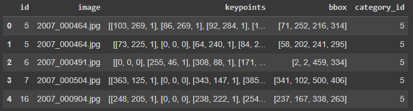
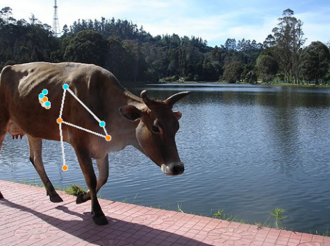
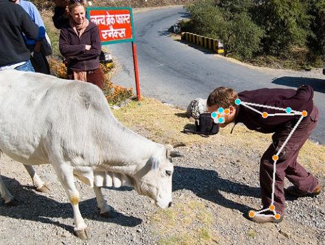
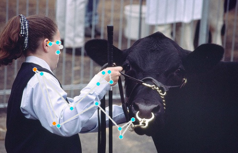

# Aluno: Yago Phellipe Matos Lopes
## Ciência da Computação
### Instituto de Tecnologia e Liderança
---

## Monitoramento de Posição Animal com Estimação de Pose - Pose Estimation para Bovinos

## Introdução

Este projeto visa implementar um modelo de *pose estimation* especificamente para bovinos, utilizando o *Animal-Pose Dataset*. A técnica de estimação de pose tem se tornado essencial para monitorar o comportamento e a saúde de animais de forma precisa e não invasiva. 

---

## 1 - Obtendo o Dataset Animal-Pose Dataset e fazendo uma análise exploratória

A primeira etapa foi a obtenção do dataset *Animal-Pose Dataset*, que contém imagens de diversos animais junto com suas anotações de *keypoints* (pontos de articulação) e caixas delimitadoras (*bounding boxes*). O dataset obtido inicialmente faltava algumas imagens de bovinos, então foi realizada uma busca no Kaggle para completar a coleção.

Os dados principais estão contidos no arquivo `keypoints.json`, que inclui informações essenciais como IDs das imagens, coordenadas dos pontos de articulação (keypoints), caixas delimitadoras e a categoria à qual cada imagem pertence. Aqui está uma visualização inicial dos dados que foi extraída:

Ao explorar o dataset, verificamos a distribuição de imagens para cada categoria de animal. A contagem de imagens por categoria pode ser vista na tabela abaixo:

Com esses dados, foi gerado um gráfico para facilitar a visualização da distribuição de animais no dataset:

As categorias de animais foram identificadas da seguinte forma:

- ID: 1, Nome: *dog*
- ID: 2, Nome: *cat*
- ID: 3, Nome: *sheep*
- ID: 4, Nome: *horse*
- ID: 5, Nome: *cow*

---

## 2 - Filtragem do Dataset para Imagens de Bovinos

Como o objetivo deste projeto é focar na estimação de pose para bovinos, o próximo passo foi filtrar o dataset para trabalhar apenas com imagens da categoria *cow* (ID: 5). Para isso, um código foi implementado para filtrar as imagens cujo `category_id` fosse igual a 5, garantindo que apenas as imagens de bovinos fossem processadas.

Entretanto, para poder utilizar essas imagens no modelo de *pose estimation*, foi necessário associar os IDs das imagens aos nomes dos arquivos correspondentes. Isso foi feito criando uma nova variável `data` que uniu as informações do arquivo `keypoints.json` com os dados de imagem, utilizando o ID da imagem como chave. O resultado desse processo pode ser visto na tabela abaixo, que mostra os dados filtrados e prontos para serem processados no modelo:

---

## 3 - Resultados Finais e Análise

Durante a implementação do modelo de pose estimation utilizando o MediaPipe Pose, observamos que o modelo foi originalmente pré-treinado para identificar keypoints em humanos. Esse fato impactou diretamente os resultados ao tentar aplicar a técnica para bovinos.

Em algumas imagens, como a mostrada abaixo, o modelo foi capaz de identificar o boi e colocar os keypoints, mas eles foram posicionados de forma incorreta, revelando a inadequação do modelo para este tipo de dado:

Nesta imagem, podemos ver que o modelo tenta marcar articulações que seriam típicas em humanos, como joelhos e cotovelos, mas aplica esses pontos em locais incorretos no boi. Essa limitação ocorre porque os keypoints do modelo estão otimizados para corpos humanos e não para animais.

Em outros casos, o modelo até identifica um humano corretamente ao lado do boi, mas falha completamente ao posicionar os pontos-chave no animal, como podemos ver na imagem abaixo:

Aqui, o modelo detectou corretamente o humano, mas ignorou completamente o boi, mostrando que o modelo pré-treinado para humanos não consegue generalizar adequadamente para outros tipos de corpos, como o de bovinos.

Com isso, os resultados obtidos são limitados e não podem ser considerados totalmente confiáveis para bovinos, reforçando a necessidade de treinar o modelo com um dataset específico de animais para garantir a precisão na identificação dos keypoints.

---
## 4 - Conclusões e Aprendizados

Esse projeto ajudou a entender como aplicar técnicas de *pose estimation*, mas ao mesmo tempo revelou as limitações de usar um modelo pré-treinado com dados de humanos para identificar animais. O fato do modelo ter sido treinado para detectar poses humanas dificultou bastante a detecção das poses dos bois. Além disso, o modelo posicionou os *keypoints* de forma incorreta nos animais, mostrando que ele não está adaptado para essa tarefa específica.

Ficou claro que é essencial treinar o modelo com dados que realmente sejam adequados ao objetivo do projeto. O próximo passo seria treinar o modelo novamente, mas desta vez usando um dataset de bovinos, para garantir que ele consiga identificar corretamente as articulações e poses desses animais. Isso tornaria o modelo muito mais eficaz e específico para o uso no monitoramento de bovinos.

